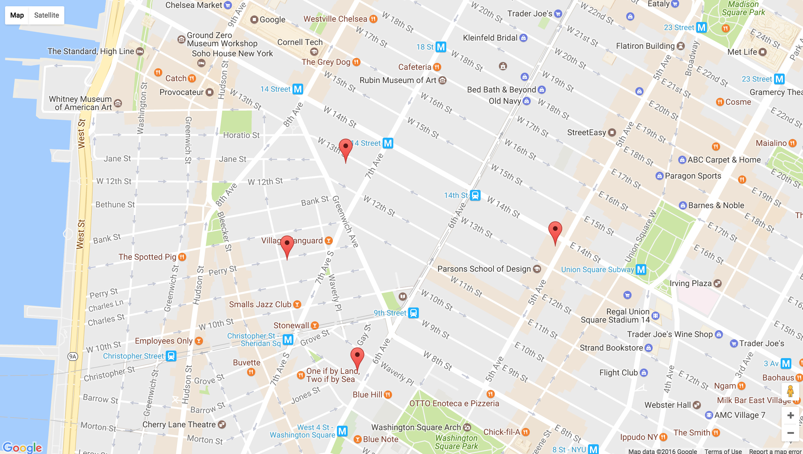

## AA Meetings - Final Assignment 1

[Running App](https://data-structures-w9-samvickars.c9users.io/)

### Contents of Mongo Database ([Weekly Assignment 6](https://github.com/svickars/data-structures/blob/master/weeklyAssignments/week6/query.js))
First five results shown
```javascript
[{
    "_id": "57fbc14799485111b69cf460",
    "groupName": "A DESIGN FOR LIVING -",
    "locationName": "St Andrews Church",
    "streetAddress": "20+Cardinal+Hayes+Place,+New+York,+NY",
    "notes": "@Duane and Centre behind Federal courthouse enter thru driveway behind Church No meetings on Holidays",
    "day": "Thursdays",
    "startTime": 700,
    "endTime": 800,
    "meetingType": "OD (Open Discussion meeting)",
    "latLong": {
        "lat": 40.7133468,
        "lng": -74.0025814
    },
    "address": "St. Andrew's Church, 20 Cardinal Hayes Pl, New York, NY 10007, USA"
}, {
    "_id": "57fbc14799485111b69cf461",
    "groupName": "A DESIGN FOR LIVING -",
    "locationName": "St Andrews Church",
    "streetAddress": "20+Cardinal+Hayes+Place,+New+York,+NY",
    "notes": "@Duane and Centre behind Federal courthouse enter thru driveway behind Church No meetings on Holidays",
    "day": "Tuesdays",
    "startTime": 700,
    "endTime": 800,
    "meetingType": "B (Beginners meeting)",
    "latLong": {
        "lat": 40.7133468,
        "lng": -74.0025814
    },
    "address": "St. Andrew's Church, 20 Cardinal Hayes Pl, New York, NY 10007, USA"
}, {
    "_id": "57fbc14799485111b69cf462",
    "groupName": "CHAMBERS STREET - A BRIDGE BACK - Chambers Street - A Bridge Back",
    "locationName": "St. Andrew's Church",
    "streetAddress": "20+Cardinal+Hayes+Place,+New+York,+NY",
    "notes": "No meetings on Holidays. **LOCATION SUBJECT TO CHANGE- Call Inter-Group",
    "day": "Mondays",
    "startTime": 1215,
    "endTime": 1315,
    "meetingType": "OD (Open Discussion meeting)",
    "latLong": {
        "lat": 40.7133468,
        "lng": -74.0025814
    },
    "address": "St. Andrew's Church, 20 Cardinal Hayes Pl, New York, NY 10007, USA"
}, {
    "_id": "57fbc14799485111b69cf463",
    "groupName": "CHAMBERS STREET - A BRIDGE BACK - Chambers Street - A Bridge Back",
    "locationName": "St. Andrew's Church",
    "streetAddress": "20+Cardinal+Hayes+Place,+New+York,+NY",
    "notes": "No meetings on Holidays. **LOCATION SUBJECT TO CHANGE- Call Inter-Group",
    "day": "Wednesdays",
    "startTime": 1215,
    "endTime": 1315,
    "meetingType": "S (Step meeting)",
    "latLong": {
        "lat": 40.7133468,
        "lng": -74.0025814
    },
    "address": "St. Andrew's Church, 20 Cardinal Hayes Pl, New York, NY 10007, USA"
}, {
    "_id": "57fbc14799485111b69cf464",
    "groupName": "CHAMBERS STREET - A BRIDGE BACK - Chambers Street - A Bridge Back",
    "locationName": "St. Andrew's Church",
    "streetAddress": "20+Cardinal+Hayes+Place,+New+York,+NY",
    "notes": "No meetings on Holidays. **LOCATION SUBJECT TO CHANGE- Call Inter-Group",
    "day": "Thursdays",
    "startTime": 1215,
    "endTime": 1315,
    "meetingType": "B (Beginners meeting)",
    "latLong": {
        "lat": 40.7133468,
        "lng": -74.0025814
    },
    "address": "St. Andrew's Church, 20 Cardinal Hayes Pl, New York, NY 10007, USA"
}
...]
```

### Query Results, 5:45pm on a Saturday ([Weekly Assignment 10](https://github.com/svickars/data-structures/tree/master/weeklyAssignments/week10/6))
First five results shown
```javascript
[{
        "_id": {
            "latLong": {
                "lat": 40.7944661,
                "lng": -73.9706389
            }
        },
        "meetingGroups": [{
            "groupInfo": {
                "latLong": {
                    "lat": 40.7944661,
                    "lng": -73.9706389
                },
                "meetingName": "NINETY-SIXTH STREET WORKSHOP - Ninety-Sixth Street Workshop",
                "locationName": "Holy Name Church",
                "meetingAddress": "207 W 96th St, New York, NY 10025, USA",
                "meetingDetails": "Anniv. Last Thursday, Fri=Promises, Sat=As Bill Sees It"
            },
            "meetingDay": [
                "Saturdays"
            ],
            "meetingStartTime": [
                2200
            ],
            "meetingType": [
                "C (Closed Discussion meeting)"
            ]
        }]
    }, {
        "_id": {
            "latLong": {
                "lat": 40.727553,
                "lng": -73.987661
            }
        },
        "meetingGroups": [{
            "groupInfo": {
                "latLong": {
                    "lat": 40.727553,
                    "lng": -73.987661
                },
                "meetingName": "EAST VILLAGE GROUP - East Village",
                "locationName": "Middle Collegiate Church",
                "meetingAddress": "50 E 7th St, New York, NY 10003, USA",
                "meetingDetails": "LGBT; all welcome. Tues 7pm=Artists in Recovery, all welcome. 8:30 1st Tues of Month Bus mtg. at 8:05"
            },
            "meetingDay": [
                "Saturdays",
                "Saturdays",
                "Saturdays"
            ],
            "meetingStartTime": [
                1900,
                1900,
                2030
            ],
            "meetingType": [
                "B (Beginners meeting)",
                "OD (Open Discussion meeting)",
                "C (Closed Discussion meeting)"
            ]
        }]
    }, {
        "_id": {
            "latLong": {
                "lat": 40.7355145,
                "lng": -74.0031001
            }
        },
        "meetingGroups": [{
            "groupInfo": {
                "latLong": {
                    "lat": 40.7355145,
                    "lng": -74.0031001
                },
                "meetingName": "PERRY STREET WORKSHOP - Perry Street Workshop     (:I)",
                "locationName": "",
                "meetingAddress": "50 Perry St, New York, NY 10014, USA",
                "meetingDetails": "No 8:30 or 10:15 1st Wed of month due to Bus. meeting Wed.10:15pm=No BB 1st Wed."
            },
            "meetingDay": [
                "Saturdays",
                "Saturdays",
                "Saturdays"
            ],
            "meetingStartTime": [
                1800,
                2030,
                2300
            ],
            "meetingType": [
                "OD (Open Discussion meeting)",
                "C (Closed Discussion meeting)",
                "C (Closed Discussion meeting)"
            ]
        }]
    }, {
        "_id": {
            "latLong": {
                "lat": 40.7576553,
                "lng": -73.9899274
            }
        },
        "meetingGroups": [{
            "groupInfo": {
                "latLong": {
                    "lat": 40.7576553,
                    "lng": -73.9899274
                },
                "meetingName": "ALANON HOUSE   (AA Meetings Only) -",
                "locationName": "",
                "meetingAddress": "303 W 42nd St, New York, NY 10036, USA",
                "meetingDetails": "Sun.2pm=Women&apos;s Meeting"
            },
            "meetingDay": [
                "Saturdays",
                "Saturdays"
            ],
            "meetingStartTime": [
                1815,
                2000
            ],
            "meetingType": [
                "C (Closed Discussion meeting)",
                "C (Closed Discussion meeting)"
            ]
        }, {
            "groupInfo": {
                "latLong": {
                    "lat": 40.7576553,
                    "lng": -73.9899274
                },
                "meetingName": "42nd AT 9:00pm -",
                "locationName": "",
                "meetingAddress": "303 W 42nd St, New York, NY 10036, USA",
                "meetingDetails": "Sat=A.A. Literature"
            },
            "meetingDay": [
                "Saturdays"
            ],
            "meetingStartTime": [
                2115
            ],
            "meetingType": [
                "C (Closed Discussion meeting)"
            ]
        }]
    }, {
        "_id": {
            "latLong": {
                "lat": 40.7380161,
                "lng": -74.0011104
            }
        },
        "meetingGroups": [{
            "groupInfo": {
                "latLong": {
                    "lat": 40.7380161,
                    "lng": -74.0011104
                },
                "meetingName": "SOBER MIRACLES - Sober Miracles",
                "locationName": "Lesbian, Gay, Bi-Sexual &amp; Transgender Community Center",
                "meetingAddress": "208 W 13th St, New York, NY 10011, USA",
                "meetingDetails": "S&amp;M Lifestyles"
            },
            "meetingDay": [
                "Saturdays"
            ],
            "meetingStartTime": [
                2130
            ],
            "meetingType": [
                "OD (Open Discussion meeting)"
            ]
        }, {
            "groupInfo": {
                "latLong": {
                    "lat": 40.7380161,
                    "lng": -74.0011104
                },
                "meetingName": "WOMEN TOGETHER                      (:I) - Women Together    (:I)",
                "locationName": "Lesbian, Gay, Bi-Sexual &amp; Transgender Community Center",
                "meetingAddress": "208 W 13th St, New York, NY 10011, USA",
                "meetingDetails": "Women&apos;s Meeting Lesbian Focus.  All are welcome"
            },
            "meetingDay": [
                "Saturdays"
            ],
            "meetingStartTime": [
                1800
            ],
            "meetingType": [
                "C (Closed Discussion meeting)"
            ]
        }, {
            "groupInfo": {
                "latLong": {
                    "lat": 40.7380161,
                    "lng": -74.0011104
                },
                "meetingName": "LAeX - TERMINAL UNIQUENESS -",
                "locationName": "Lesbian, Gay, Bisexual, &amp; Transgender Community Center",
                "meetingAddress": "208 W 13th St, New York, NY 10011, USA",
                "meetingDetails": "LA Transplants/Vistors    All Welcome"
            },
            "meetingDay": [
                "Saturdays"
            ],
            "meetingStartTime": [
                2000
            ],
            "meetingType": [
                "O (Open meeting)"
            ]
        }]
    }
...}]
```

### Resulting Map
