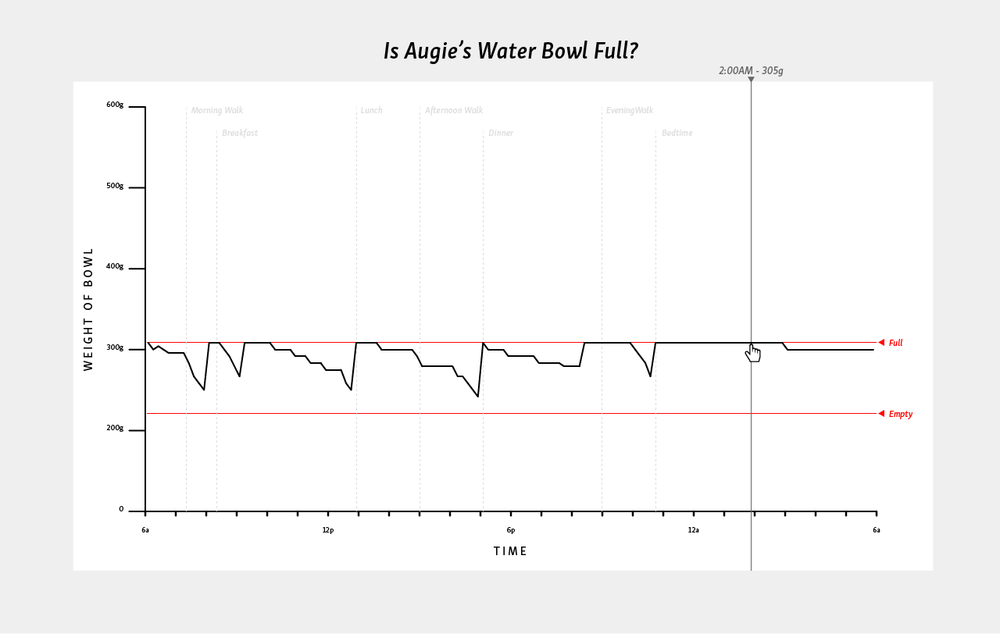

## Augie's Waterbowl - Final Assignment 2

[Running App]()

### Visualization of Sketch


### Collecting the Data ([Weekly Assignment 8](https://github.com/svickars/data-structures/blob/master/weeklyAssignments/week8/app.js))
```javascript
var five = require("johnny-five"),
  fsr, force, fsrG, fsrR, fsrADC, fsrV;

var VCC = 4.98;
var R_DIV = 3230.0;

(new five.Board()).on("ready", function() {

  // Create a new `fsr` hardware instance.
  fsr = new five.Sensor({
    pin: "A0",
    freq: 1000
  });

    fsr.on("change", function() {
      var fsrADC = this.value; //raw value from sensor, if no pressure resistance will be near infinite, so:
      if (fsrADC != 0)
      {
        // calculate voltage
        fsrV = fsrADC * VCC / 1023.0;
        // calculate resistance
        fsrR = R_DIV * (VCC / fsrV - 1.0);
        // calculate conductance
        fsrG = 1.0 / fsrR;
        // calculate foce based on two linear slopes
        if (fsrR <= 600)
          force = (fsrG - 0.00075) / 0.00000032639;
        else
          force = fsrG / 0.000000642857;
        // display results in ohms and grams
        console.log("resistance: " + fsrR + " ohms ");
        console.log("force: " + force + "g");
      }
    });
});
```

To set up my FSR (force sensitive resistor) and Arduino board, I followed this [tutorial](http://johnny-five.io/examples/sensor-fsr/). I then did some quick math to convert the raw data returned from the sensor into a more tangible unit, grams. There were some issues getting the weight of the bowl to register on the sensor. Unfortunately, I don't have a photo, but my workaround was to place the bowl on an olive oil bottle lid, which was then placed on the sensor (on a hard, flat surface) to pinpoint the weight onto the sensor. I then had to build up a little bumper structure to keep Augie from knocking the whole set-up over.
>Note: There was an issue collecting the data in that sometime in the middle of the night, the bowl steadily began to get heavier. As in, *a lot* heavier. I've done some troubleshooting, but I'm still not entirely sure what happened. As of right now, I haven't tried to recollect the data, so what's documented here includes the odd data. **Will try to do it over before Tuesday.**

### Connecting to the Database ([Weekly Assignment 9](https://github.com/svickars/data-structures/blob/master/weeklyAssignments/week9/week9.js))

```javascript
var five = require("johnny-five");
var pg = require('pg');

// connection string
var un = process.env.USERNAME; // aws db username
var pw = process.env.PASSWORD; // aws db password
var db = process.env.DBNAME; // aws db database name
var ep = process.env.DBEP; // aws db endpoint
var conString = "postgres://" + un + ":" + pw + "@" + ep + "/" + db;
// console.log(conString);

var fsr, led, force, fsrG, fsrR, fsrADC, fsrV;
var VCC = 4.98;
var R_DIV = 3230.0;

new five.Board().on("ready", function() {

  // Create a new `fsr` hardware instance.
  fsr = new five.Sensor({
    pin: "A0",
    freq: 1000
  });

  fsr.on("change", function() {
    var fsrADC = this.value;
    if (fsrADC != 0)
    {
        fsrV = fsrADC * VCC / 1023.0;
        fsrR = R_DIV * (VCC / fsrV - 1.0);
        fsrG = 1.0 / fsrR;
        if (fsrR <= 600)
          force = (fsrG - 0.00075) / 0.00000032639;
        else
          force = fsrG / 0.000000642857;
        console.log("resistance: " + fsrR + " ohms ");
        console.log("force: " + force + " g");

        // var createTableQuery = "CREATE TABLE walking (dateCreated timestamp DEFAULT current_timestamp, force numeric, resistance numeric);"
        var insertIntoQuery = "INSERT INTO superbowlIII VALUES (DEFAULT, " + force + ", " + fsrR + ");"

        pg.connect(conString, function(err, client, done) {
          if(err) {
            return console.error('error fetching client from pool', err);
          }

            client.query(insertIntoQuery, function(err, result) {
                //call `done()` to release the client back to the pool
                done();

                if(err) {
                  return console.error('error running query', err);
                }
            }); //end client.query
        }); //end pg connect
    }
  });
})
```
The code above connects to my database on Amazon Web Services and inserts three fields: datecreated (the time stamp at time of entry), force (the weight of the water bowl in grams), resistance (in ohms), and what was intended to be fullness (full or not full, but this didn't pan out).

### Contents of Postgres Database ([Weekly Assignment 9](https://github.com/svickars/data-structures/blob/master/weeklyAssignments/week9/query.js))

```javascript
[{
    "datecreated": "2016-11-19T20:12:04.653Z",
    "force": "253.5276198927416",
    "resistance": "6135.646687697161",
    "fullness": null
}, {
    "datecreated": "2016-11-19T20:12:11.429Z",
    "force": "251.43512265480703",
    "resistance": "6186.708860759493",
    "fullness": null
}, {
    "datecreated": "2016-11-19T20:12:11.931Z",
    "force": "246.29635102881878",
    "resistance": "6315.78947368421",
    "fullness": null
}, {
    "datecreated": "2016-11-19T20:12:12.431Z",
    "force": "235.4354877544327",
    "resistance": "6607.142857142858",
    "fullness": null
}, {
    "datecreated": "2016-11-19T20:12:12.931Z",
    "force": "237.3663078921014",
    "resistance": "6553.398058252426",
    "fullness": null
}, {
    "datecreated": "2016-11-19T20:12:14.935Z",
    "force": "253.5276198927416",
    "resistance": "6135.646687697161",
    "fullness": null
}, {
    "datecreated": "2016-11-19T20:12:16.450Z",
    "force": "254.58195806288637",
    "resistance": "6110.236220472442",
    "fullness": null
}, {
    "datecreated": "2016-11-19T20:12:16.953Z",
    "force": "252.4786885850077",
    "resistance": "6161.137440758295",
    "fullness": null
}, {
    "datecreated": "2016-11-19T20:12:18.458Z",
    "force": "239.3162924976377",
    "resistance": "6499.999999999999",
    "fullness": null
}, {
    "datecreated": "2016-11-19T20:12:20.456Z",
    "force": "239.3162924976377",
    "resistance": "6499.999999999999",
    "fullness": null
}
...]
```

### Connecting the Data to the Visualization
The visualization (sketch above)

[create an anchor](###visualization-of-sketch)